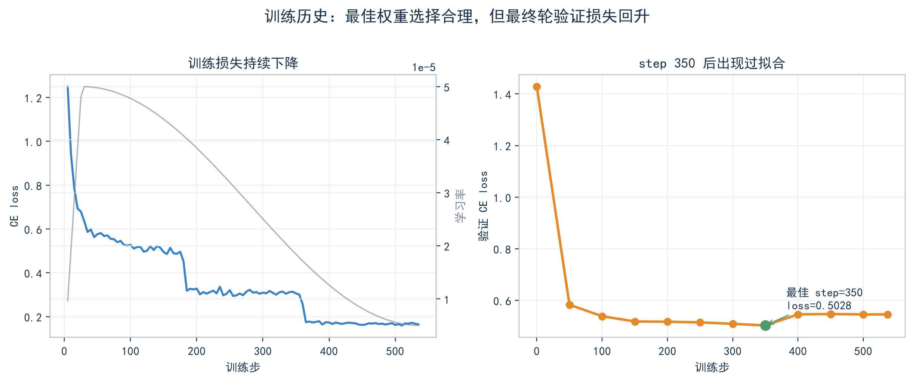

# Murmur v0.1.0 推理效果与评估

本文记录 GitHub Release `v0.1.0` 两份权重的可核验训练指标、文本简化自动评估和实际推理样例。精确数值另见 [`evaluation/results/v0.1.0_metrics.json`](evaluation/results/v0.1.0_metrics.json)，文本简化验证 loss 序列见 [`evaluation/results/text_simplification_validation_loss.csv`](evaluation/results/text_simplification_validation_loss.csv)，旧版 140M 与当前 203M 的对比数据见 [`evaluation/results/version_comparison_summary.json`](evaluation/results/version_comparison_summary.json)。全部公开图表已经直接展示在 [`README.md`](README.md)。

## 1. 基础预训练模型

基础权重是中文 Decoder-only 续写模型，不是经过指令微调的聊天助手。下列指标直接读取自发布检查点元数据：

| 指标 | 数值 |
| --- | ---: |
| 参数量 | 203,037,056 |
| 检查点 step | 68,000 |
| 最佳验证 CE loss | 2.9117594164 |
| 由 loss 计算的 PPL | 18.3891242487 |
| 上下文长度 | 2,048 tokens |

发布包是 weights-only 包，没有携带完整预训练日志和逐步 loss 曲线，因此这里不补造训练曲线，也不把配置中的训练预算写成实际已处理 token 数。

### 实际续写样例

运行配置：[`configs/inference_pretrained_203m.yaml`](configs/inference_pretrained_203m.yaml)。采样参数为 temperature `0.7`、top-k `50`、top-p `0.9`、repetition penalty `1.08`、固定 seed `20260830`。为便于阅读，下面只展示每次生成的前半段；不同 PyTorch 版本或硬件可能产生细微差异。

**样例 1**

> 输入：中国传统文化源远流长，
>
> 输出：博大精深。中华文化的博大精深，是中华文化生生不息的奥秘所在。中华优秀传统文化中蕴含着丰富的哲学思想、人文精神和道德规范。在历史的长河中，中华民族形成了以爱国主义为核心的团结统一、爱好和平、勤劳勇敢、自强不息的伟大民族精神……

**样例 2**

> 输入：在软件开发过程中，良好的测试习惯能够
>
> 输出：减少项目返工次数，提高软件质量。同时，在项目测试完成后，可以及时将测试报告提交给用户，以便进行后续的维护工作。测试的流程主要包括需求分析、设计测试用例和执行测试……

复现命令：

```bash
python scripts/generate.py \
  --config configs/inference_pretrained_203m.yaml \
  --prompt "中国传统文化源远流长，" \
  --max-new-tokens 96
```

## 2. 文本简化训练指标

文本简化模型是在 Murmur 203M Base 上进行的全参数 SFT。loss 仅覆盖目标文本和 EOS，不能与基础预训练的全 token loss 直接横向比较。

| 指标 | 数值 |
| --- | ---: |
| 总训练步数 | 537 |
| 最佳检查点 | step 350 |
| 初始验证 CE loss / PPL | 1.4282 / 4.17 |
| 最佳验证 CE loss / PPL | 0.5027853699 / 1.6533199708 |
| 最终验证 CE loss / PPL | 0.5457210036 / 1.7258522796 |
| 监督训练 tokens | 6,580,812 |
| 处理 tokens | 15,343,104 |
| 训练耗时 | 1,090.80 秒（约 18 分 11 秒） |
| 监督 tokens/s | 6,032.99 |
| 优化器步稳定性 | 537/537 成功；0 AMP overflow；0 non-finite gradient skip |



验证 loss 在 step 350 达到最低点，之后回升；发布的 `best_weights_only` 权重来自最佳点，而不是最终 step 537。这也是同时公布最佳值和最终值的原因。

## 3. 文本简化自动评估

评估从训练使用过的 validation split 中以固定方式抽取 200 对样本，因此它适合检查同分布能力和发布回归，不应被解释成独立、无偏的测试集成绩。SARI、ROUGE-L 和 chrF 使用项目内的中文字符级实现。

基础预训练权重使用同一文本简化提示协议作为 zero-shot 对照；它不是指令模型，这个对照主要用于量化 SFT 对任务行为的改变。

| 指标 | 文本简化模型 | 基础模型 zero-shot |
| --- | ---: | ---: |
| SARI | 0.716924 | 0.245132 |
| ROUGE-L F1 | 0.915904 | 0.120733 |
| chrF | 0.790481 | 0.132906 |
| 与参考答案完全一致率 | 0.310000 | 0.000000 |
| 输出/输入长度比 | 0.942954 | 12.607268 |
| EOS 或 stop 命中率 | 0.995000 | 0.000000 |
| 数字 precision | 0.991071 | 0.186889 |
| 数字 recall | 1.000000 | 0.455782 |
| 空输出率 | 0.000000 | 0.000000 |
| 特殊 token 泄漏率 | 0.000000 | 0.000000 |
| 重复率 | 0.012579 | 0.841644 |
| 平均生成 tokens | 33.715 | 256.000 |

数字指标基于 56 条含数字样本。基础模型平均生成 256 tokens 且 stop 命中率为 0，说明它把任务提示当成了普通续写；不要把这组 zero-shot 数字解读成通用语言能力排名。

## 4. 文本简化实际样例

以下输出于 2026-08-30 使用公开权重、贪心解码和仓库默认文本简化配置重新生成。

| 场景 | 输入 | 输出 |
| --- | --- | --- |
| 新闻删冗 | 由于连续多日出现强降雨天气，相关部门决定暂时关闭部分山区景区，以确保游客的人身安全。 | 由于连续多日出现强降雨，相关部门决定暂时关闭部分山区景区，确保游客人身安全。 |
| 口语去冗余 | 这个事情呢，我们就是说，还是需要大家再进一步认真地讨论一下，然后再作出最后的决定。 | 这件事，我们还是需要大家进一步认真讨论，再作出最后的决定。 |
| 数字保持 | 该项目计划投资12.5亿元，建设周期为3年，预计新增就业岗位2400个。 | 该项目计划投资12.5亿元，建设周期为3年，预计新增就业岗位2400个。 |
| 简单句保守输出 | 会议将于明天上午九点举行。 | 会议将于明天上午九点举行。 |

复现命令：

```bash
python scripts/simplify_text.py \
  --config configs/inference_text_simplification_203m.yaml \
  --text "这个事情呢，我们就是说，还是需要大家再进一步认真地讨论一下，然后再作出最后的决定。" \
  --long-text-mode never
```

## 5. 限制

- validation split 参与了检查点选择，公开指标不是独立测试集结果。
- 自动指标不能替代双盲人工评审；单参考答案会惩罚部分合理改写。
- 基础预训练包没有完整训练日志，只能核验检查点内保存的最佳验证 loss。
- 文本简化模型可能欠简化，也可能删除限定语、实体或因果信息；长文本切块还可能引入跨块不一致或重复。
- 延迟强依赖硬件和软件环境，因此本报告没有把历史运行延迟当作可跨设备比较的基准。
