# Murmur

> **一套真正从数据到模型、从训练到推理全链路开源的中文小模型工程。**

Murmur 不只是一个模型权重或演示脚本，而是一套完整、模块化、可复现的中文 Decoder-only Transformer 训练系统。项目覆盖语料处理、32K tokenizer、203M 参数预训练、断点续训、全参数 SFT、文本简化、长文本分块、自动评估和本地推理，并直接发布可用的预训练与文本简化权重。

<p align="center">
  
  
  
  
</p>

<p align="center">
  <a href="https://github.com/GUaas/murmur/releases/tag/v0.1.0"><strong>下载模型</strong></a> ·
  <a href="#推理"><strong>立即推理</strong></a> ·
  <a href="#从头预训练"><strong>从头训练</strong></a> ·
  <a href="EVALUATION.md"><strong>完整评估</strong></a>
</p>

> English summary: Murmur is a fully open, end-to-end Chinese language-model project with a modular training stack, a 203M pretrained model, a text-simplification model, long-text inference, reproducible evaluation, and ready-to-use release weights.

## 项目亮点

- **完整训练闭环**：不是只有推理代码；从原始 JSONL、token cache、预训练、断点恢复到全参数 SFT 全部打通。
- **两套可用权重**：同时发布 Murmur 203M 基础预训练模型与文本简化模型，可直接下载、本地加载和二次训练。
- **面向真实工程**：配置、诊断、指标、checkpoint、恢复状态和测试体系齐全，适合研究复现与继续开发。
- **长文本能力增强**：内置分句分块方案，在 16 篇独立长文档上将尾部事实保留提升至 `100%`，数字召回提升至 `96.1%`。
- **文本简化效果扎实**：发布权重在 200 对验证样本上达到 SARI `0.716924`、ROUGE-L `0.915904`、chrF `0.790481`。
- **结果全部公开**：训练 loss、质量指标、CPU 性能、压力测试与长文本 A/B 图表均可在首页直接查看。

## 开源范围

本仓库包含：

- 完整训练与推理源码：`muddywater/`
- 数据清洗、缓存、训练、评估和发布脚本：`scripts/`
- 文本简化数据管线与长文本推理代码
- 单元测试：`tests/`
- Murmur 203M 预训练与文本简化配置：`configs/`
- 32K SentencePiece tokenizer：`tokenizer/sp_unigram_32k.model`
- 模型结构、校验值和使用说明：`MODEL_CARD.md`、`models/README.md`

为保持仓库轻量、合规且可直接克隆，训练数据、缓存、密钥和优化器状态不进入 Git 历史；经过复核的指标与样例收录在 `EVALUATION.md`，模型权重通过 GitHub Releases 独立发布。

## Murmur 203M 结构

| 项目 | 配置 |
| --- | --- |
| 参数量 | 203,037,056 |
| 层数 | 20 |
| 隐藏维度 | 896 |
| Attention heads / KV heads | 14 / 2 |
| 上下文长度 | 基础预训练 2,048 tokens；文本简化 896 tokens |
| 词表 | 32,000 |
| 归一化 / MLP / 位置编码 | RMSNorm / SwiGLU / RoPE |
| 其他 | tied embeddings、QK normalization、无 bias |

## 效果速览

以下均为发布权重的真实训练与评估结果。完整复现实验协议、指标定义和机器可读数据见 [`EVALUATION.md`](EVALUATION.md)。

| 项目 | 结果 |
| --- | ---: |
| 基础预训练检查点 | step 68,000 |
| 基础预训练最佳验证 CE loss / PPL | 2.911759 / 18.3891 |
| 文本简化最佳验证 CE loss / PPL | 0.502785 / 1.6533（step 350） |
| 文本简化最终验证 CE loss / PPL | 0.545721 / 1.7259（step 537） |
| 文本简化验证集 SARI / ROUGE-L / chrF | 0.716924 / 0.915904 / 0.790481 |
| 数字 precision / recall（56 条含数字样本） | 0.991071 / 1.000000 |

基础模型是续写模型，不是指令助手。固定配置下的实际续写片段：

> 输入：中国传统文化源远流长，
>
> 输出：博大精深。中华文化的博大精深，是中华文化生生不息的奥秘所在。中华优秀传统文化中蕴含着丰富的哲学思想、人文精神和道德规范。

文本简化模型的实际输出：

| 输入 | 输出 |
| --- | --- |
| 由于连续多日出现强降雨天气，相关部门决定暂时关闭部分山区景区，以确保游客的人身安全。 | 由于连续多日出现强降雨，相关部门决定暂时关闭部分山区景区，确保游客人身安全。 |
| 这个事情呢，我们就是说，还是需要大家再进一步认真地讨论一下，然后再作出最后的决定。 | 这件事，我们还是需要大家进一步认真讨论，再作出最后的决定。 |
| 该项目计划投资12.5亿元，建设周期为3年，预计新增就业岗位2400个。 | 该项目计划投资12.5亿元，建设周期为3年，预计新增就业岗位2400个。 |

## 文本简化完整评估图表

核心结果不藏在附件里：训练曲线、质量评估、压力测试、CPU 性能和长文本 A/B 全部直接展示。评估按三层协议组织：

- 发布回归：从 checkpoint-selection validation split 固定抽取 200 对，结果就是上方的 `SARI 0.716924`。
- 多场景评估：500 条同分布验证复核，以及 135 条不参与训练的独立压力样例。
- 长文本评估：16 篇独立长文档，对比整篇直接推理和分句分块推理。

完整复现实验说明和精确数值见 [`EVALUATION.md`](EVALUATION.md)，机器可读结果位于 [`evaluation/results/`](evaluation/results/)。点击图片可以查看原图。

### 当前 Murmur 203M：核心能力评估

当前 203M checkpoint 已完成 500 条同分布验证、135 条独立压力样例、边界输入和 CPU 性能测试。模型在中文文本简化、数字保持与确定性推理上表现稳定；面对更长输入时，可直接配合仓库内置的分句分块方案扩展处理能力。

<table>
  <tr>
    <td width="50%"><a href="docs/assets/evaluation/current/01_quality_overview.png">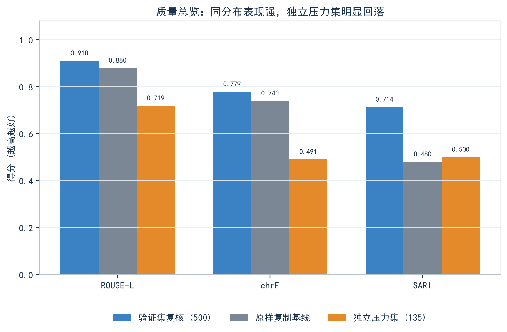</a><br><sub>500 条验证复核、复制基线与 135 条独立压力集</sub></td>
    <td width="50%"><a href="docs/assets/evaluation/current/02_length_degradation.png">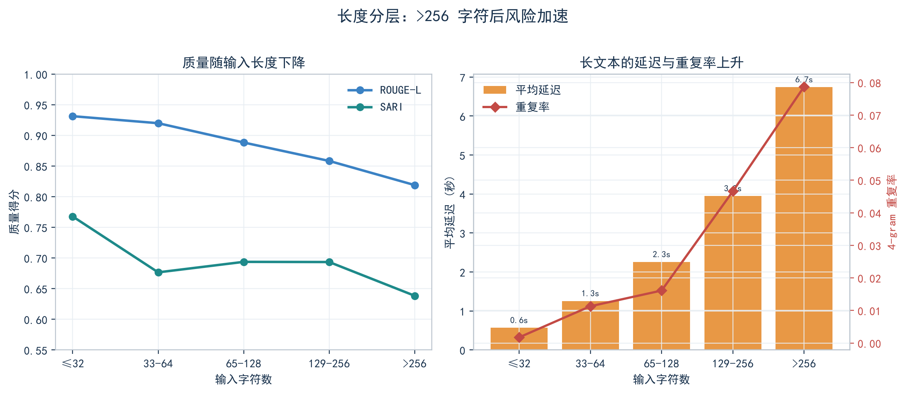</a><br><sub>输入长度扩展下的质量、延迟与生成行为</sub></td>
  </tr>
  <tr>
    <td width="50%"><a href="docs/assets/evaluation/current/03_stress_categories.png">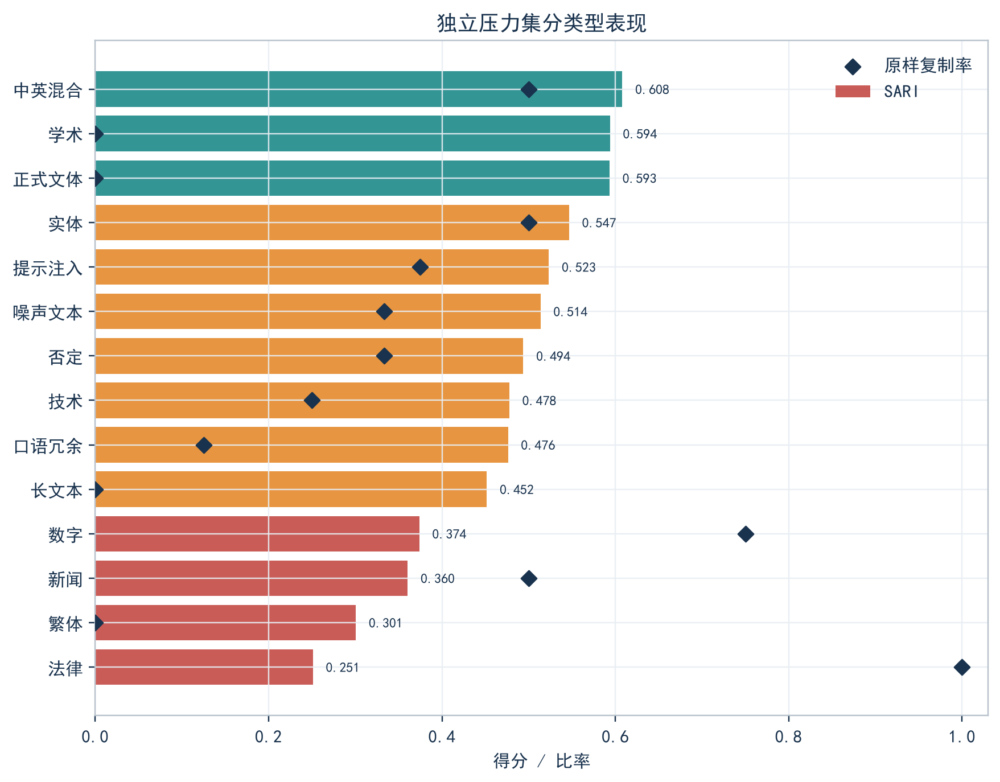</a><br><sub>独立压力集分类 SARI 与原样复制率</sub></td>
    <td width="50%"><a href="docs/assets/evaluation/current/06_reliability_scorecard.png">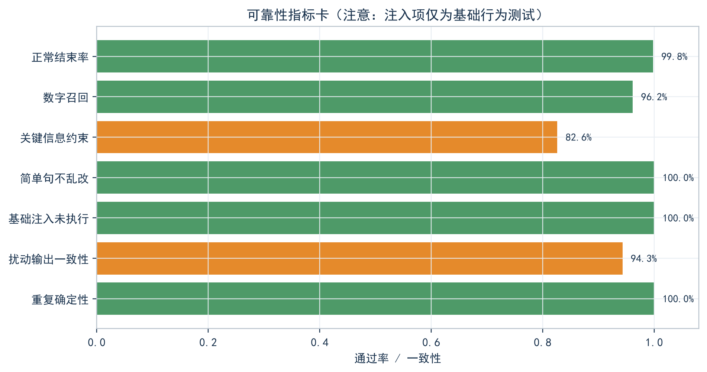</a><br><sub>结束、数字、关键信息、简单句和扰动可靠性</sub></td>
  </tr>
  <tr>
    <td width="50%"><a href="docs/assets/evaluation/current/04_latency_distribution.png">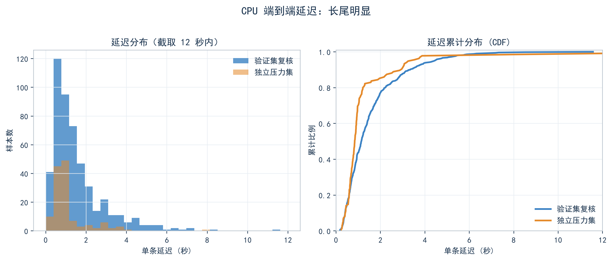</a><br><sub>CPU 单条延迟分布与累计分布</sub></td>
    <td width="50%"><a href="docs/assets/evaluation/current/05_performance_scaling.png">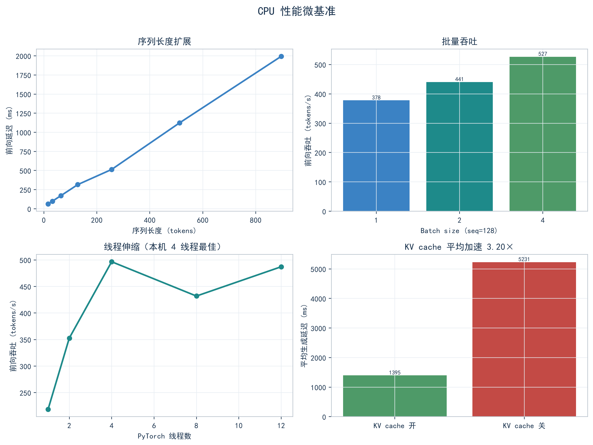</a><br><sub>长度、batch、线程和 KV cache 微基准</sub></td>
  </tr>
</table>

<a href="docs/assets/evaluation/current/07_training_curve.png"></a>

验证 CE loss 在 step 350 达到最佳值 `0.502785`；Release 采用验证集表现最优的 checkpoint，确保公开权重对应本轮训练的最佳观测结果。

### 当前 Murmur 203M：长文本分块评估

在 16 篇独立长文档上，分句分块相对整篇直接推理将 ROUGE-L 从 `0.424` 提高到 `0.669`、SARI 从 `0.442` 提高到 `0.600`、数字召回从 `40.8%` 提高到 `96.1%`、尾部事实保留从 `43.8%` 提高到 `100%`。在约 `2.01×` 端到端计算时间下，换取了显著更强的长文本完整性。

<table>
  <tr>
    <td width="50%"><a href="docs/assets/evaluation/long_text/01_quality_ab.png">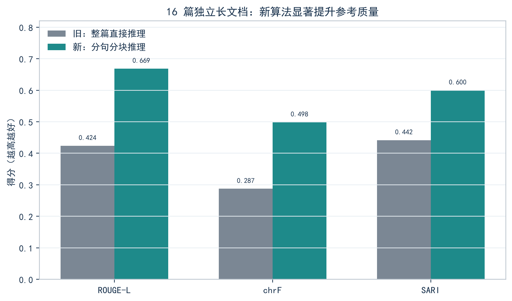</a><br><sub>直接推理 vs 分句分块：ROUGE-L、chrF、SARI</sub></td>
    <td width="50%"><a href="docs/assets/evaluation/long_text/02_reliability_ab.png">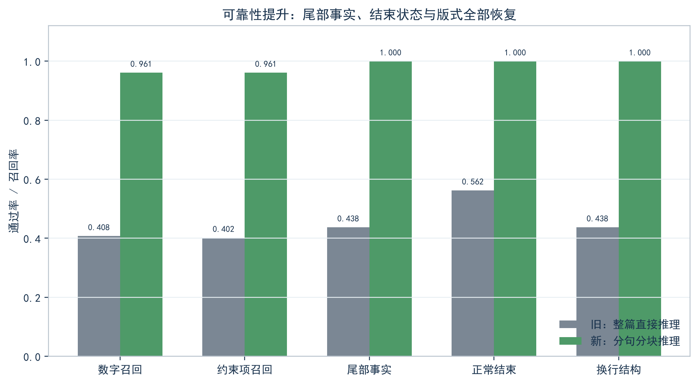</a><br><sub>数字、约束项、尾部事实、结束状态与版式</sub></td>
  </tr>
  <tr>
    <td width="50%"><a href="docs/assets/evaluation/long_text/03_latency_vs_length.png">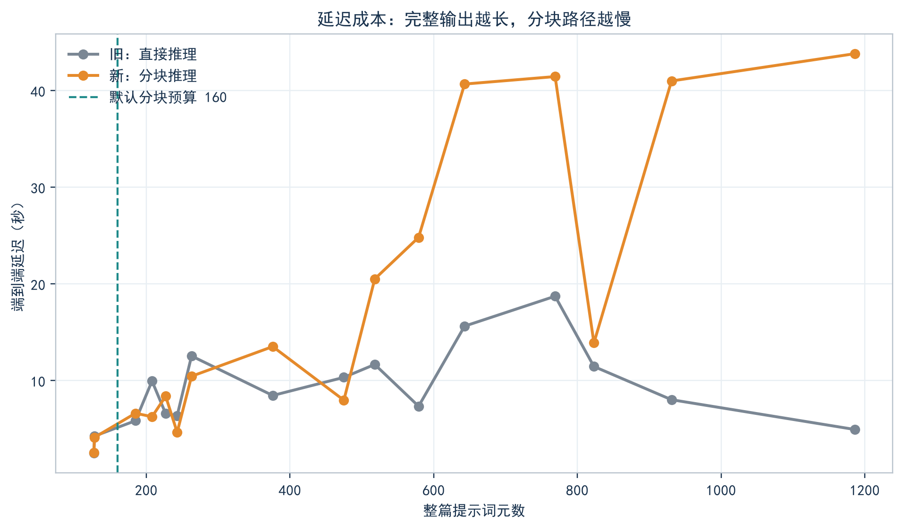</a><br><sub>完整性提升带来的端到端延迟成本</sub></td>
    <td width="50%"><a href="docs/assets/evaluation/long_text/04_quality_by_length.png">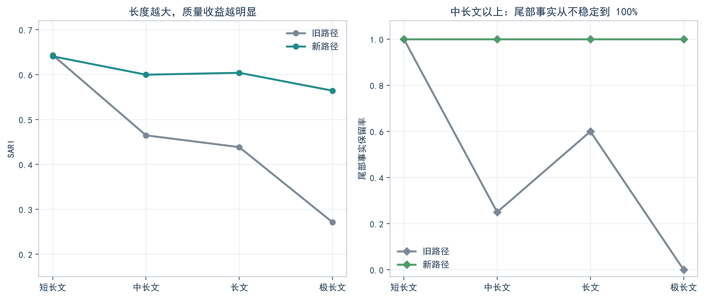</a><br><sub>长度越大，分块的质量和尾部事实收益越明显</sub></td>
  </tr>
  <tr>
    <td width="50%"><a href="docs/assets/evaluation/long_text/05_budget_sweep.png">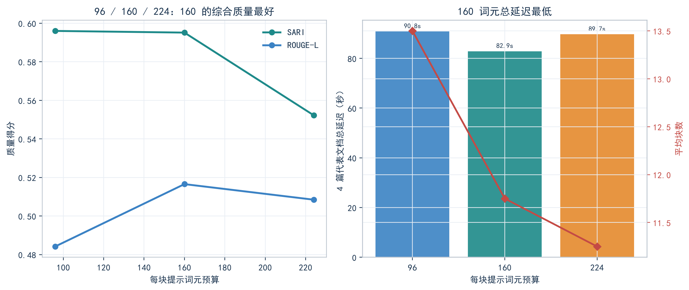</a><br><sub>96 / 160 / 224 tokens；160 为当前综合默认值</sub></td>
    <td width="50%"><a href="docs/assets/evaluation/long_text/06_segmentation_planning.png">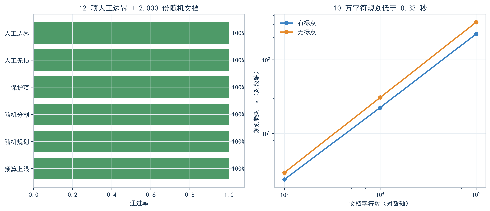</a><br><sub>人工边界、随机重建和 10 万字符规划性能</sub></td>
  </tr>
  <tr>
    <td width="50%"><a href="docs/assets/evaluation/long_text/07_per_document_delta.png">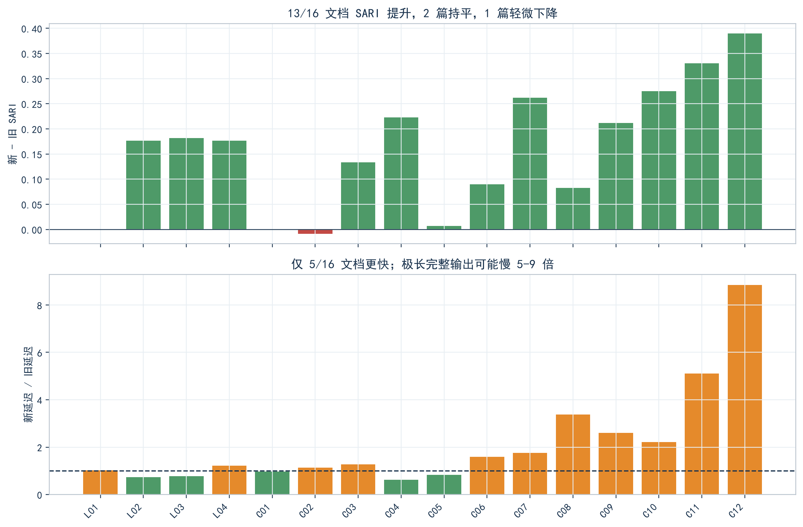</a><br><sub>13/16 文档 SARI 提升，逐篇展示长文本质量收益</sub></td>
    <td width="50%"><a href="docs/assets/evaluation/long_text/08_chunk_count_cost.png">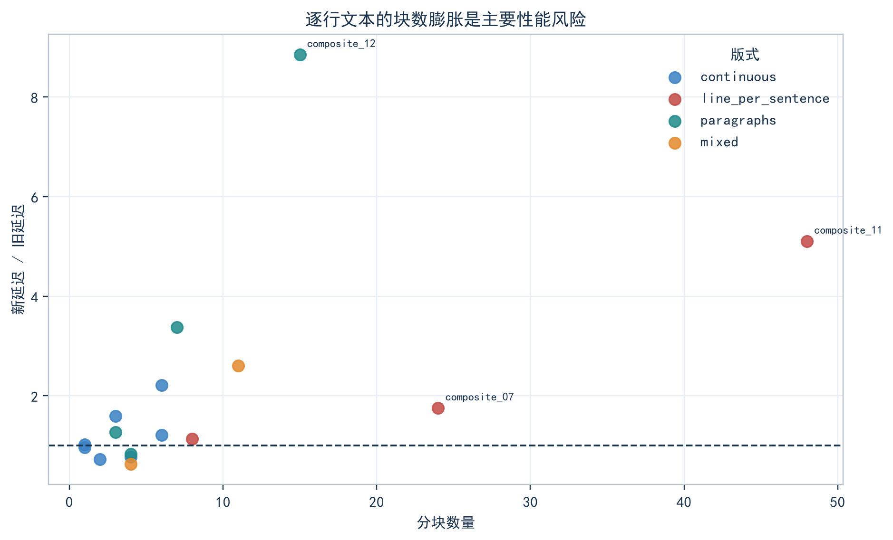</a><br><sub>块数增长与端到端性能开销关系</sub></td>
  </tr>
</table>

## 安装

需要 Python 3.10+ 和 PyTorch 2.2+。CUDA 训练环境建议使用 BF16。

```bash
git clone https://github.com/GUaas/murmur.git
cd murmur
python -m venv .venv
source .venv/bin/activate
python -m pip install -e ".[dev]"
```

Windows PowerShell 激活环境：

```powershell
.\.venv\Scripts\Activate.ps1
python -m pip install -e ".[dev]"
```

## 从头预训练

输入语料使用 UTF-8 JSONL，每行至少包含一个 `text` 字段：

```json
{"text":"要用于预训练的一段中文文本。"}
```

先构建分片 token cache：

```bash
python scripts/prepare_pretrain_cache.py \
  --input "data/pretrain/raw/*.jsonl" \
  --tokenizer tokenizer/sp_unigram_32k.model \
  --output-dir data/pretrain/cache \
  --jsonl-text-key text \
  --max-tokens-per-shard 100000000
```

检查并按硬件、数据量调整 `configs/pretrain_203m_example.yaml`，再启动训练：

```bash
bash run_pretrain.sh
```

该配置提供可直接启动的 203M 训练基线。训练系统会自动记录配置、运行环境、诊断、指标和断点信息，方便扩展数据规模、调整配方并稳定续训。

## 文本简化 SFT

1. 从 Releases 下载基础预训练权重到 `model/murmur_203m_base_weights_only.pt`。
2. 准备成对数据，推荐字段为 `source` 和 `target`。
3. 将处理结果放到 `data/text_simplification/processed/`，或修改配置中的路径。
4. 启动全参数 SFT。

```bash
python scripts/prepare_text_simplification_data.py \
  --input /path/to/dataset.jsonl \
  --output-dir data/text_simplification/processed \
  --source-key source \
  --target-key target

bash run_text_simplification_sft.sh
```

训练与推理协议为：

```text
<|im_start|>{source}<|im_end|>{target}<eos>
```

损失仅覆盖目标文本和 EOS，源文本与结构标签不参与损失。

## 推理

### 基础预训练模型续写

从 Releases 下载基础权重后运行：

```bash
python scripts/generate.py \
  --config configs/inference_pretrained_203m.yaml \
  --prompt "中国传统文化源远流长，" \
  --max-new-tokens 96
```

### 文本简化

从 Releases 下载文本简化权重到：

```text
model/murmur_203m_text_simplification_best_weights_only.pt
```

Linux：

```bash
./run_simplify.sh "由于近期连续出现强降雨天气，相关部门决定暂时关闭部分山区景区。"
```

Windows PowerShell：

```powershell
.\run_simplify.ps1 -Text "由于近期连续出现强降雨天气，相关部门决定暂时关闭部分山区景区。"
```

## 验证

```bash
pytest -q
python scripts/validate_text_simplification_setup.py \
  --config configs/sft_text_simplification_203m.yaml
```

## 模型与许可证

代码按 Apache License 2.0 发布。模型权重的许可证、训练数据来源、用途限制和 SHA-256 以对应 Release 与 `MODEL_CARD.md` 为准；数据集不会随仓库分发。

在生产环境使用前，请自行进行安全、偏差、事实性、隐私和提示注入测试。Murmur 不是医疗、法律、金融或其他高风险场景的替代决策系统。
